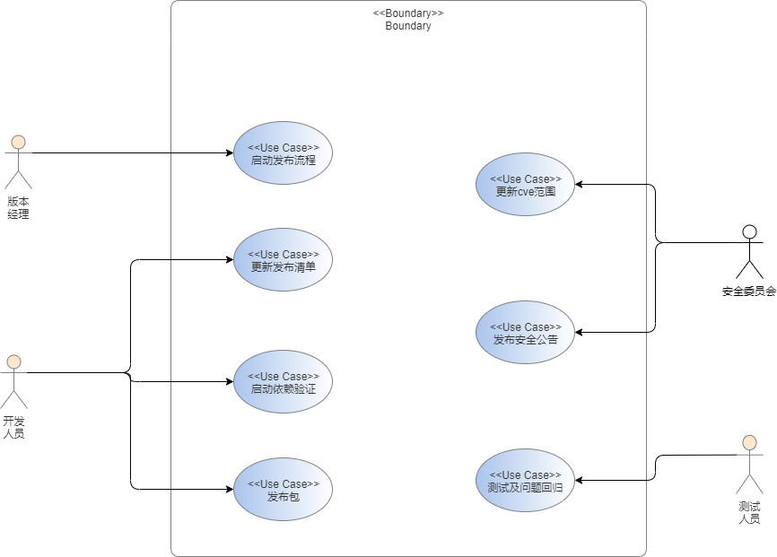
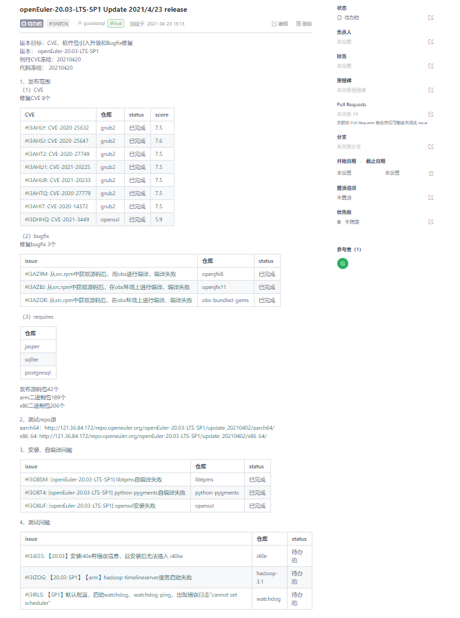

# update发布自动化工具设计文档

## 1. 背景
openEuler社区对于LTS版本中的软件提供全量的漏洞修复，通过定期发布软件包提供安全漏洞的修复补丁。漏洞修复SLO为，9.0~10.0分漏洞，7天内修复；7.0~8.9 分漏洞，14内修复；0.1~6.9分漏洞，30天内修复。为了保证SLO达成率目标90%，有必要将发布周期缩短为7天，因此发布流程自动化成为openEuler 漏洞处理能力提升的关键路径之一。


update发布自动化工具通过码云issue串联起整个update发布流程，将分散的子流程，包括确定发布范围、测试、发布安全公告整合成完整的发布流程，提升发布效率和实现发布过程的可视化。

## 2. 需求分析
### 2.1 需求描述
1. 提供一键式启动发布流程功能，版本经理在release-management仓库中创建版本发布issue，在评论中评论/start-update启动发布流程；
2. 提供更新发布清单功能，通过在版本发布issue中评论/add $type $issueID 或者/delete $type $issueID，增加或删除发布包；
3. 提供开发自验功能，通过在版本发布issue中评论/check-requires，启动依赖范围检查、自编译和安装验证；
4. 提供检查并更新update版本的问题单状态，在版本发布issue的描述中罗列当前发布版本的issue，评论/check-status可获取issue最新状态。

### 2.2 依赖组件
|组件|组件描述|
|:--|:-------|
| cve-manager                       | 提供需发布cve清单和安全公告         |
| jenkins                  | 提供开发自验证环境、发布包接口                         |
| CI-bot          | 通过issue评论触发对应操作           |
| gitee                 | 提供issue管理接口                             |
| openEuler.org                 | 发布安全公告口接口                                 |

### 2.3 USE-CASE视图


涉及外部人员为版本经理、开发人员、测试人员和安全委员会成员。在整个发布流程中，版本经理启动发布流程，创建空白issue并且评论/start-update启动发布流程。开发人员负责流程的驱动，通过评论触发依赖验证和发布包。安全委员会成员侧重关注CVE相关功能。在工具自动生成发布清单之后，安全委员会成员进行cve范围审核和更新，开发人员进行其他发布包（bugfix、特性、升级）范围的审核和更新。测试人员负责测试，及对问题的回归验收。

### 2.4 issue评论说明
#### 2.4.1 issue评论逻辑图


版本经理创建空白issue并评论/start-update启动发布流程。开发人员及安全委员会人员审核完发布包范围分别评论/pkg-ok和/cve-ok，满足这两个评论触发依赖验证。由工具自动启动依赖验证、上传测试目录、安装和自编译检查后，开发自验证通过后转测，转测回归通过后由测试人员评论/test-ok，自动触发发布评审。测试发现问题则由测试人员通过评论/add test $issueID添加问题单到版本issue中。审核人员审核完评论/check-ok，自动启动发布包。安全委员会人员审核完归档的cvrf文件，评论/cvrf-ok，满足/check-ok和/cvrf-ok，启动发布安全公告。

#### 2.4.2 评论说明
|编号|评论|标签|操作人员|说明|
|:--|:---|:--|:---|:-----|
|①|/start-update|update-check-pkg|版本经理|启动发布流程，工具获取cve和bugfix发布范围，回写到issue描述中，添加标签check-pkg|
|②|/add cve I3NQ1A|NA|安全委员会|添加cve，工具自动修改版本issue描述中的cve清单|
|②|/delete cve #I3NQ1A|NA|安全委员会|删除cve，工具自动修改版本issue描述中的cve清单|
|②|/add bugfix #I3AZ9M|NA|开发人员|添加bugfix，工具自动修改版本issue描述中的bugfix清单|
|②|/delete bugfix #I3AZ9M|NA|开发人员|删除bugfix，工具自动修改版本issue描述中的bugfix清单|
|③|/cve-ok|update-check-requires|安全委员会成员|审核完cve清单且没有问题，满足/cve-ok和/bugfix-ok触发检查依赖操作，添加标签check-requires|
|③|/bugfix-ok|update-check-requires|开发人员|审核完bugfix清单且没有问题，满足/cve-ok和/bugfix-ok触发检查依赖操作，添加标签check-requires|
|④|/check-status|NA|开发人员|检查issue清单中的最新issue状态，并更新到版本发布issue的描述中|
|⑤|/get-requires|NA|开发人员|触发检查依赖操作|
|⑥|/test-ok|update-release-check|测试人员|测试回归通过，触发发布评审，添加标签release-check|
|⑦|/check-ok|update-release|tc、release、qa、安全委员会|发布评审通过，触发发布包及发布列表归档，添加标签update-release|
|⑧|/cvrf-ok|NA|安全委员会|安全公告检查完成且没有问题，满足/check-ok和/cvrf-ok触发发布安全公告|
|⑨|/no-release #I3NQ1A|NA|版本经理|问题未解决，评审决策本次版本不发布，遗留到下一版本|

#### 2.4.3 issue模板参考举例


### 2.5 模块设计


命令解析模块：功能模块，解析版本发布issue中的评论触发对应操作
用户权限校验模块： 校验请求命令的用户是否有权限
版本issue管理模块：功能模块，管理版本issue内容，根据传入参数创建（issue内容、issue类型、里程碑）issue
issue描述解析模块：功能模块，获取到版本发布issue中的相关内容
开发自验证模块：功能模块，验证依赖、安装、自编译
验证结果解析模块：功能模块，解析验证结果，触发下一步操作
问题单状态检查模块：功能模块，检查issue是否已经完成
发布模块：功能模块，发布包和安全公告

### 2.6 接口设计


#### 2.6.1 命令行接口
1. 启动发布流程
- oe-art start #I3NQ1A

2. 更新发布范围
- oe-art modify -releaseid #I3NQ1A -addcve #I3AZ9M -giteeid ruebb
- oe-art modify -releaseid #I3NQ1A -delcve #I3AZ9M -giteeid ruebb
- oe-art modify -releaseid #I3NQ1A -addbug #I3AZ9M -giteeid ruebb
- oe-art modify -releaseid #I3NQ1A -delbug #I3AZ9M -giteeid ruebb
- oe-art modify -releaseid #I3NQ1A -addtest #I3AZ9M -giteeid ruebb
- oe-art modify -releaseid #I3NQ1A -deltest #I3AZ9M -giteeid ruebb

- 参数说明：

   |参数|说明|
   |:--|:-------|
   |releaseid|版本发布issue的ID|
   |addcve|添加的CVE issue的ID|、
   |delcve|删除的CVE issue的ID|
   |addbug|添加的bugfix issue的ID|
   |delbug|删除的bugfix issue的ID|
   |addtest|添加的测试issue的ID|
   |deltest|删除的测试issue的ID|

3. 确认发布范围
- oe-art check -releaseid #I3NQ1A -type cve ok -giteeid ruebb
- oe-art check -releaseid #I3NQ1A -type cve nok -giteeid ruebb
- oe-art check -releaseid #I3NQ1A -type bug ok -giteeid ruebb
- oe-art check -releaseid #I3NQ1A -type bug nok -giteeid ruebb

- 参数说明：

   |参数|说明|
   |:--|:-------|
   |releaseid|版本发布issue的ID|
   |type|cve/bug，后面的参数为ok/nok|
   |giteeid|触发操作的人员的码云ID|

4. 检查最新issue状态
- oe-art check -releaseid #I3NQ1A -type status
- 参数说明：

   |参数|说明|
   |:--|:-------|
   |releaseid|版本发布issue的ID|

5. 获取需增加依赖包的列表
- oe-art check -releaseid #I3NQ1A -type requires -giteeid ruebb
- 参数说明：

   |参数|类型|说明|
   |:--|:--|:--|
   |releaseid|版本发布issue的ID|
   |giteeid|触发操作的人员的码云ID|

6. 确认测试结果
- oe-art check -releaseid #I3NQ1A -type test ok -giteeid ruebb
- oe-art check -releaseid #I3NQ1A -type test nok -giteeid ruebb

- 参数说明：

   |参数|说明|
   |:--|:-------|
   |releaseid|版本发布issue的ID|
   |giteeid|触发操作的人员的码云ID|

7. 确认发布
- oe-art release -releaseid #I3NQ1A -type checkok -giteeid ruebb
- 参数说明：

   |参数|说明|
   |:--|:-------|
   |releaseid|版本发布issue的ID|
   |giteeid|触发操作的人员的码云ID|

8. 确认安全公告
- oe-art release -releaseid #I3NQ1A -type cvrfok -giteeid ruebb
- 参数说明：

   |参数|说明|
   |:--|:-------|
   |releaseid|版本发布issue的ID|
   |giteeid|触发操作的人员的码云ID|

9. 问题遗留
- oe-art modify -releaseid #I3NQ1A -norelease #I3AZ9M -giteeid ruebb
- oe-art modify -releaseid #I3NQ1A -release #I3AZ9M -giteeid ruebb

   |参数|说明|
   |:--|:-------|
   |releaseid|版本发布issue的ID|
   |giteeid|触发操作的人员的码云ID|


#### 2.6.3 内部接口
##### 2.6.3.1 用户权限校验模块
1. users_check
- 接口描述：

    判断请求操作的用户是否有相关权限

- 请求参数：

    |参数|类型|说明|
    |:--|:--|:--|
    |user|str|请求命令的用户名|
    |comment|str|请求命令的评论|

- 返回参数
    | 参数  | 类型 | 说明           |
    | :---- | :--- | :------------- |
    | True  | bool | 权限校验成功 |
    | False | bool | 权限校验失败 |

##### 2.6.3.2 命令解析模块
1. commands
- 接口描述：

    解析请求命令的评论

- 请求参数：

    |参数|类型|说明|
    |:--|:--|:--|
    |comment|str|请求命令的评论|

- 返回参数

    |参数|类型|说明|
    |:--|:--|:--|
    |command|str|执行的命令|

- 评论对应的命令
    |评论|命令|说明|
    |:--|:--|:--|
    |start-update|auto-release start|启动发布流程|
    |add/delete cve/bugfix/requires/test $modifyIssueID|auto-release add/delete $releaseIssueID [-cve/bugfix/requires/test $modifyIssueID]|修改发布范围|
    |get-requires|auto-release get-requires $releaseIssueID|启动开发自验证流程|
    |check-status|auto-release check-issues-status $releaseIssueID|更新issue状态|
    |test-ok|auto-release check-release $releaseIssueID|启动发布审核|
    |check-ok|auto-release release-update-pkg $releaseIssueID $timestamp auto-release|启动包发布|
    |check-ok|upload-update-list $releaseIssueID|归档发布列表|
    |check-ok and cvrf-ok|auto-release release-update-sa $releaseIssueID $timestamp|启动安全公告发布|

##### 2.6.3.3 版本issue管理模块
    
1. get_CVE_list

   - 接口描述：
    获取cve-manager提供的CVE相关的信息，将该信息添加到"issue描述"属性中，回写网页端的issue描述

   - 
   
   CVE 相关信息表示：
    ```
    [
        { 
          "CVE_id": "xxx1",
          "score": 7.5,
          "repository" : "xxx"
          "issue_id": "xxx1",
          "status" : "closed"
          "version" : "1.1.1"
          "abi_changed" : "TRUE"
        },
                { 
          "CVE_id": "xxx2",
          "score": 8.2,
          "repository" : "xxx"
          "issue_id": "xxx2",
          "status" : "closed"
          "version" : "2.0"
          "abi_changed" : "FALSE"
        }  
    ]
    ```

   - 请求参数

     None

  - 返回参数

       | 参数  | 类型 | 说明        |
       | :---- | :--- | :---------- |
       | True  | bool | 操作成功 |
       | False | bool | 操作失败 |

       

2. get_bugfix_list

   - 接口描述：
     获取bugfix issue的相关的信息，将该信息添加到"issue描述"属性中，回写网页端的issue描述

   - 请求参数：
   
     None

   - bugfix 相关信息表示

      ```
        [
            { 
              "issue_id": "xxx1",
              "repository": "xxx",
              "status" : "closed"
            },
            { 
              "issue_id": "xxx2",
              "repository": "xxx",
              "status" : "xxx"
            }  
        ]
      ```
   - 返回参数
   
       | 参数  | 类型 | 说明        |
       | :---- | :--- | :---------- |
       | True  | bool | 操作成功 |
       | False | bool | 操作失败 |
   
3. update_issue_description
    根据issue的各项描述信息（如CVE、bugfix等），并回写网页issue的描述
    
    - 请求参数
    
    None
    
    - 返回参数
     
       | 参数  | 类型 | 说明           |
       | :---- | :--- | :------------- |
       | True  | bool | 回写成功 |
       | False | bool | 回写失败 |
       
    - 网页端回写样式

        https://gitee.com/angela7/release-management/issues/I3NTCN

4. parse_issue_commands
   -  接口描述

    解析update issue的命令

    - 请求参数

       | 参数          | 类型 | 说明      |
       | :------------ | :--- | :-------- |
       | issue_command | str  | issue命令|

    - 返回参数 

       | 参数          | 类型 | 说明      |
       | :------------ | :--- | :-------- |
       | operation | str  | 操作类型例如delete、add|
       | type | str  | 例如CVE、bugfix|

5. update_CVE_list
    -  接口描述

    根据操作类型对CVE进行增删，将CVE信息更新到"issue描述"属性中，回写网页端的issue描述

    - 请求参数

       | 参数          | 类型 | 说明      |
       | :------------ | :--- | :-------- |
       | operation | str  | 操作类型，例如delete、add|
       | CVE_id | str  | cve的id|

    - 返回参数 
       | 参数          | 类型 | 说明      |
       | :------------ | :--- | :-------- |
       | True | bool  | 操作成功|
       | False | bool  | 操作失败|

6. update_bugfix_list
     -  接口描述
       
     根据操作类型对bugfix进行增删，将bugfix信息更新到"issue描述"属性中，回写网页端的issue描述

     - 请求参数

        | 参数          | 类型 | 说明      |
        | :------------ | :--- | :-------- |
        | operation | str  | 操作类型，例如delete、add|
        | issue_id | str  | issue的id|

     - 返回参数 
        | 参数          | 类型 | 说明      |
        | :------------ | :--- | :-------- |
        | True | bool  | 操作成功|
        | False | bool  | 操作失败|

##### 2.6.3.4 issue描述解析模块
1. get_update_list

    -  接口描述
    
    获取版本发布issue中的发布列表
    
    - 请求参数
    
    None
    
    - 返回参数 (列表类型)

    | 参数     | 类型 | 说明         |
    | :------- | :--- | :----------- |
    | pkglist  | list  | CVE、bugfix、requires涉及所有的包   |
    
2. get_repo

    -  接口描述
    
    获取测试的repo源
    
    - 请求参数
    
    None
    
    - 返回参数 (字典类型)

    | 参数     | 类型 | 说明         |
    | :------- | :--- | :----------- |
    | aarch64      | str  | aarch64的repo源    |
    | x86  | str  | x86的repo源 |

     -  返回示例
     ```
     {
    "aarch64": "http://xxxx",
    "x86": "http://xxxx"
     }
     ```
3. get_branch
    - 接口描述：

        获取发布版本
    
    - 请求参数
    
    None
    
    - 返回参数：

    | 参数     | 类型 | 说明         |
    | :------- | :--- | :----------- |
    | branch     | str  | 发布版本    |


##### 2.6.3.5 开发自验证模块
1. get_requires
    - 接口描述：
    
      检查软件包依赖，根据缺少的依赖列表，添加requires信息到"issue描述"属性中，回写网页端的issue描述
      
    - 请求参数
    
       | 参数     | 类型 | 说明         |
       | :------- | :--- | :----------- |
       | branch      | str  | 发布版本    |
       | pkglist  | list  | CVE、bugfix、requires涉及所有的包   |
    
    - 返回参数 
       | 参数          | 类型 | 说明      |
       | :------------ | :--- | :-------- |
       | True | bool  | 操作成功|
       | False | bool  | 操作失败|

2. upload_pkg_to_server

    - 接口描述
    
    获取CVE、bugfix、requires中包含的软件包名，将这些软件包名上传到测试服务器，更新release issue中的repo源
    
    - 请求参数
    
       | 参数     | 类型 | 说明         |
       | :------- | :--- | :----------- |
       | branch      | str  | 发布版本    |
       | pkglist  | list  | CVE、bugfix、requires涉及所有的包   |
    
    - 返回参数 
       | 参数          | 类型 | 说明      |
       | :------------ | :--- | :-------- |
       | True | bool  | 操作成功|
       | False | bool  | 操作失败|

3. check_install_build
    - 接口描述
    
    进行安装以及自编译的验证
    
    - 请求参数
    
        | 参数          | 类型 | 说明                   |
        | :------------ | :--- | :--------------------- |
        | branch      | str  | 发布版本    |
        | aarch64      | str  | aarch64的repo源    |
    
    - 返回参数 (字典类型)
    
        | 参数          | 类型 | 说明                   |
        | :------------ | :--- | :--------------------- |
        | True      | bool  | 验证安装自编译成功         |
        | False | bool  | 验证安装自编译失败 |

##### 2.6.3.6 验证结果解析模块
1. create_install_build_issue
    - 接口描述
    
    根据check_install_build的结果，若安装自编译失败，则提issue(如果issue是已经存在的，且将issue改为待办状态)，并将该issue添加到安装、自编译的“issue描述”属性中，回写网页端的issue描述
    
    - 请求参数
    
        | 参数       | 类型 | 说明                |
        | :--------- | :--- | :------------------ |
        | repository | str  | 待提issue的仓库名称 |
    
    - 返回参数 (字典类型)
    
        安装、自编译的issue清单
    
        | 参数          | 类型 | 说明                   |
        | :------------ | :--- | :--------------------- |
        | True      | str  | 创建issue并回写成功        |
        | False | str  | 创建issue并回写失败 |


##### 2.6.3.7 问题单状态检查模块
1、check_issue_state

- 接口描述

    更新install_build 的issue及转测的 issue状态

-  请求参数

   None

-  返回参数
  
      - 安装自编译的issue状态清单以及转测的issue清单

          | 参数  | 类型 | 说明               |
          | :---- | :--- | :----------------- |
          | install_build_issue  | str | 安装、自编译的issue |
          | overall_status  | str | issue整体状态，只要有一个issue状态为待办的，则表示不通过|
      
          - install_build_issue 参数：
          
          | 参数  | 类型 | 说明               |
          | :---- | :--- | :----------------- |
          | issue_id  | str | 安装、自编译的issue id |
          | status | str | issue 状态    |
      
- 返回示例
 ```
   {
  "install_build_issue": [
    {
      "issue_id1": "closed"
    },
    {
      "issue_id2": "status2"
    }
  ],
  "overall_status": "closed"
}
 ```

##### 2.6.3.8 发布模块
1. release_check
    - 接口描述：
        
        在版本发布issue描述中@相关人员进行发布评审

    - 请求参数：

        None

    - 返回参数 
        | 参数          | 类型 | 说明      |
        | :------------ | :--- | :-------- |
        | True | bool  | 操作成功|
        | False | bool  | 操作失败|

2. upload_release_pkg

    - 接口描述：

        归档发布列表至release-management仓库里

    - 请求参数：

        | 参数 | 类型  | 说明  |
        | :---- | :---- | :---- |
        | releasetime | str | 发布时间，作为归档目录名 |
        | branch | str | 发布版本 |

    - 返回参数 
        | 参数          | 类型 | 说明      |
        | :------------ | :--- | :-------- |
        | True | bool  | 操作成功|
        | False | bool  | 操作失败|

3. release_pkg
    - 接口描述：

        将发布的包从测试服务器拷贝到正式发布服务器

    - 请求参数：

        | 参数 | 类型  | 说明  |
        | :---- | :---- | :---- |
        | timestamp | str | repo的时间戳 |

    - 返回参数 
        | 参数          | 类型 | 说明      |
        | :------------ | :--- | :-------- |
        | True | bool  | 操作成功|
        | False | bool  | 操作失败|

4. release_SA
    - 接口描述：

        发布安全公告、cvrf和updateinfo

    - 请求参数：

        | 参数 | 类型  | 说明  |
        | :---- | :---- | :---- |
        | timestamp | str | repo的时间戳 |

    - 返回参数 
        | 参数          | 类型 | 说明      |
        | :------------ | :--- | :-------- |
        | True | bool  | 操作成功|
        | False | bool  | 操作失败|
